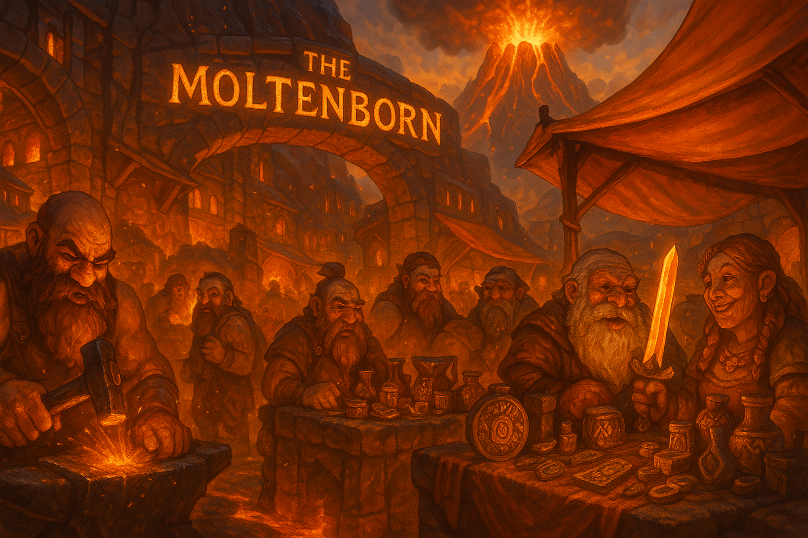

# The Moltenborn

  

> _"**Vision** without **execution** is **hallucination**."_  
> — Thomas Edison

---

## Overview

It operates under a single premise:  
**Magic Already Exists.** It's just in the form of science, and people tend to find effort boring.

**The Moltenborn** is a personal initiative exploring low-level Computer Science. As I study **magic** I'll develop my own, which will be published here as open source projects.

---

## Intent

This space serves as a library of experiments, tools, and ideas, built entirely in **_Rust_**.

My intention for The Moltenborn is to one day have built every tool for my own custom workflow, like my own advanced terminal based text-editors like vim, and my own advanced version control systems like git.

#### Currently In Development

- [ ] **Forge**  
       ‣ _What it does:_ Build automation tool  
       ‣ _Inspired by:_ `make`

#### Future Plans

- [ ] **Get myself a Wife.**

---

## Author

The Moltenborn is maintained by <a href="https://sehnsucht-nach-einer-ehefrau.vercel.app" target="_blank">me</a>, a developer interested in low-level systems programming, and cares a bit too much about their dev environment and workflow.

This is not a company, a studio, or an organization — just a guy with an interest in building things and reinventing the wheel but better(in my completely unbiased opinion).

---

## Contact

For discussion, collaboration, or curiosity:

`sehnsucht.nach.einer.ehefrau@gmail.com`

[The Moltenborn Github](https://github.com/The-Moltenborn)

---
